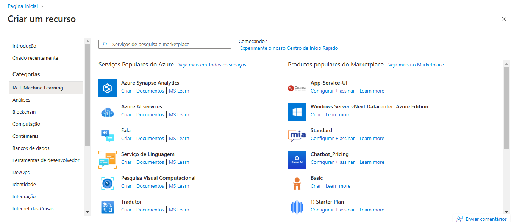
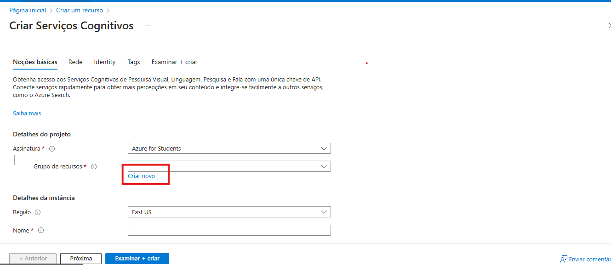
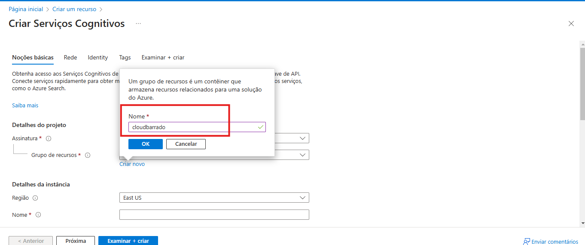

# Laboratório Prático - Criando verificação de Capacete com Custom Vision

* Abra o [portal do Azure](https://portal.azure.com/):
* Acesse Mais Recursos  e depois IA + Machine Learning
* Clique em Azure AI services para criar recursos do Serviços Cognitivos.

* Crie um Grupo de Recursos, caso ainda não tenha
* Atribua um nome ao Grupo de Recursos

* Importante:
     - Adicionar uma região para o recurso
     - nomear o recurso
     - Escolher o tipo de preço **Standard S0**
     - Deixar a caixa "Ao marcar essa caixa, confirmo que li e compreendi todos os termos abaixo" - como **checada**
     - Depois Clique em Revisar e Criar e Criar novamente

* Acesse o Serviço Cognitivo criado
* Clique em Chaves e Ponto de extremidade
* Guarde a chave e a região que criamos o serviço, iremos precisar para a aplicação

# Criando Projeto no Studio Custom Vision

Após criar os serviços cognitivos no Azure acesso o [Studio do Custom Vision](https://www.customvision.ai/)

* Clique em New Project

* Adicione um nome para o projeto: ""

* Clique em Criar Projeto e Aguarde
Agora podemos adicionar as fotos de trabalhadores com capacetes e trabalhadores sem capacete

* Após selecionar as imagens, coloque a tag "com_capacete"

* Adicione as imagens de colaboradores sem capacete, e adcione a tag "sem_capacete"

* Após adicionar todas as imagens
* Clique em Train para treinar o modelo

* Selecione: Quick Training
* Clique em Train

* Aguarde

Quando finalizar podemos testar se o modelo está bem treinado:

* Clique no Test e copie a URL de imagem de pessoa com capacete e uma sem capacete para verificar

## Com Capacete

## Sem Capacete

Agora Publique o modelo:
* Clique em Publish
* Adicione um nome para o modelo
* Selecione o Servico Cognitivo

* Agora acesse o Preciction URL para adicionar na aplciação
Você usará a URL no código da aplciação

# Criando a Aplicação

Em uma janela de console (como cmd, PowerShell ou Bash), crie um novo diretório para seu aplicativo e navegue até ele.

1. Criar um novo aplicativo do Node.js

    Em uma janela de console (como cmd, PowerShell ou Bash), crie um novo diretório para seu aplicativo e navegue até ele.

    > mkdir myappdetectepi && cd myappmyappdetectepi

    Execute o comando npm init para criar um aplicativo do Node com um arquivo package.json.

    > npm init

2. Instalar os pacotes npm @azure-rest/ai-vision-face:
    > npm install @azure-rest/ai-vision-face

    O arquivo package.json do seu aplicativo é atualizado com as dependências.

3. Crie um arquivo chamado index.html, abra o editor VS Code e crie o arquivo (veja o arquivo completo index.html - exemplo pasta code)
