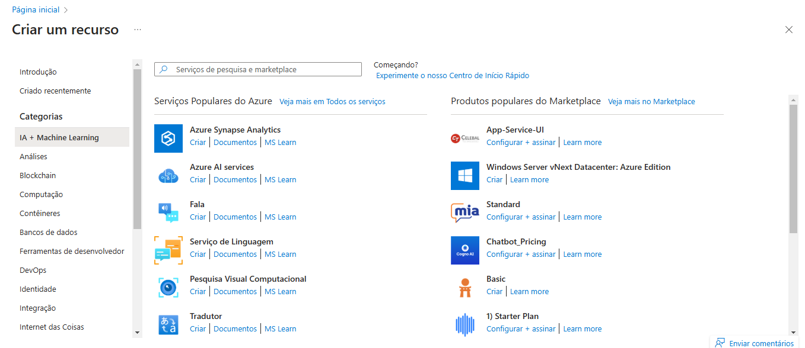
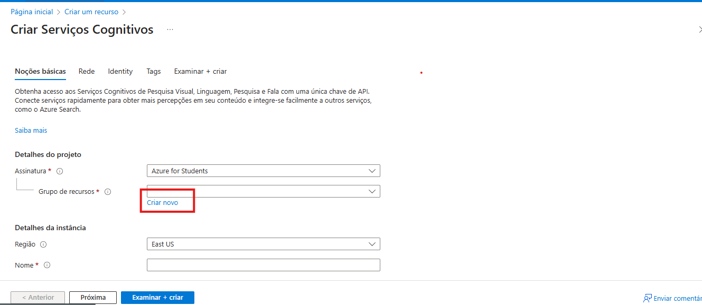
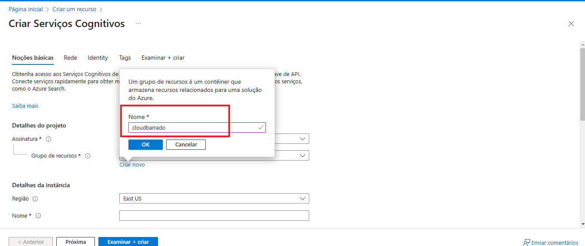
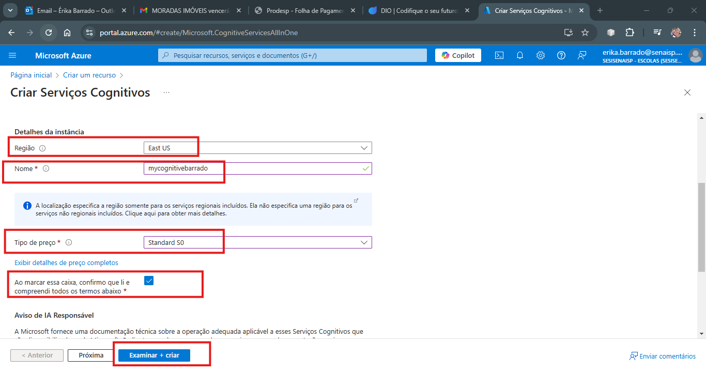
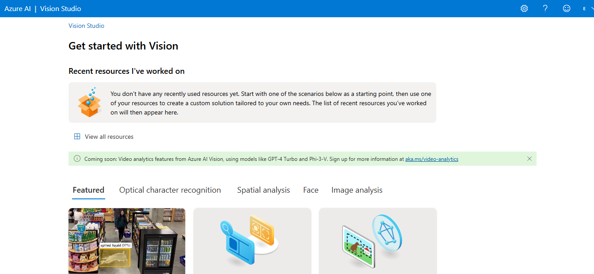
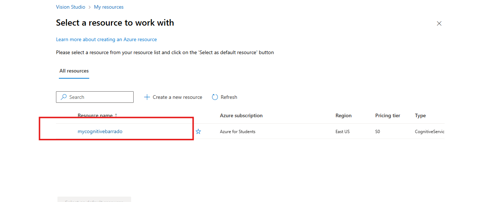
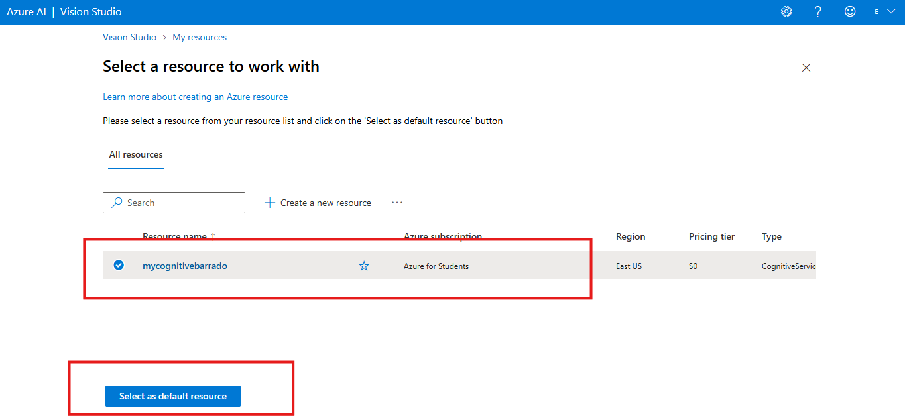
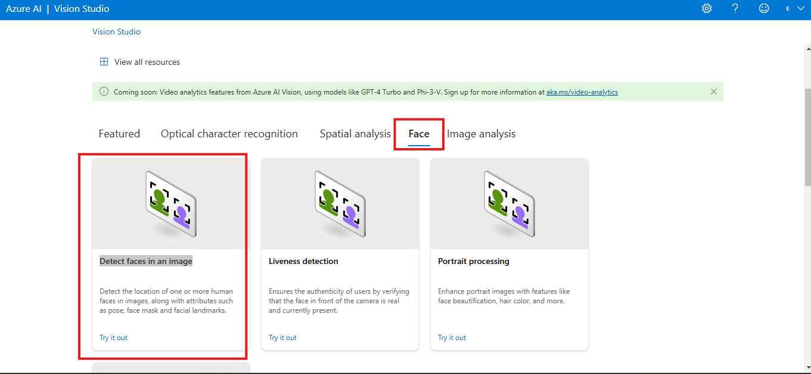
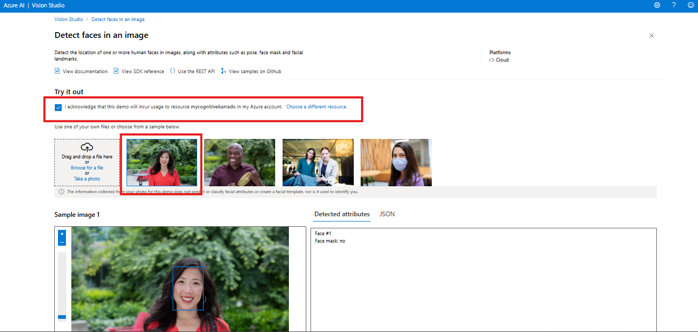
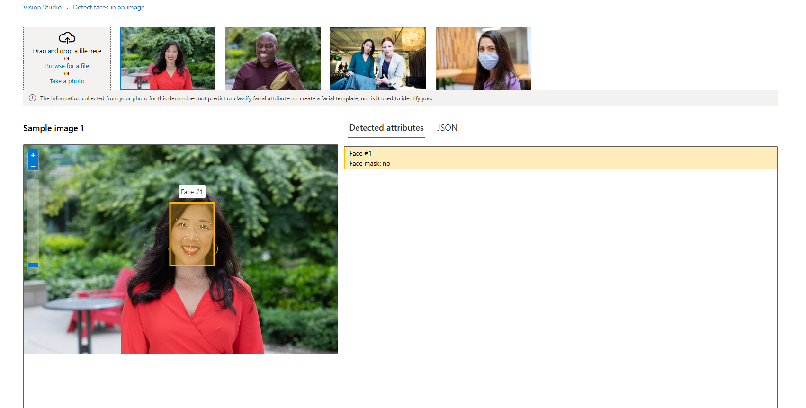

# Laboratório Prático - Serviços Cognitivos

Serviços Cognitivos: conjunto de ferramentas e APIs, ajudam a criar aplicativos inteligentes, pré-construídos e personalizávei.
Incluem capacidades como visão computacional, reconhecimento de fala, compreensão de linguagem natural, análise de sentimentos e tomada de decisão.

## Serviços de IA do Azure

Para criar aplicativos de IA, podemos utilizar serviços de IA do Azure:

<table style="border: 1px solid#b2d6cb">
    <thead >
        <tr span="2" style="background-color:#b2d6cb; color: #000">
            <th >Serviço</th>
            <th>Descrição</th>          
        </tr>
    </thead>
    <tbody>
        <tr>
            <td  style="border: 1px solid#b2d6cb">Visão Personalizada</td>
            <td  style="border: 1px solid#b2d6cb">	Personalize o reconhecimento de imagem para o seu negócio.</td>
        </tr>
         <tr>
            <td  style="border: 1px solid#b2d6cb">Visão Personalizada</td>
            <td  style="border: 1px solid#b2d6cb">	Personalize o reconhecimento de imagem para o seu negócio.</td>
        </tr>
         <tr>
            <td  style="border: 1px solid#b2d6cb">Detecção Facial</td>
            <td  style="border: 1px solid#b2d6cb">	Detectar e identificar pessoas e emoções em imagens.</td>
        </tr>
          <tr>
            <td  style="border: 1px solid#b2d6cb">LInguagem</td>
            <td  style="border: 1px solid#b2d6cb">Criar aplicativos com recursos líderes do setor de reconhecimento de linguagem natural.</td>
        </tr>
           <tr>
            <td  style="border: 1px solid#b2d6cb">Fala</td>
            <td  style="border: 1px solid#b2d6cb">Conversão de fala em texto, conversão de texto em fala, tradução e reconhecimento de locutor.</td>
        </tr>
         <tr>
            <td  style="border: 1px solid#b2d6cb">Tradutor</td>
            <td  style="border: 1px solid#b2d6cb">Use tecnologia de tradução com tecnologia de IA para traduzir mais de 100 idiomas e dialetos em uso, em risco e ameaçados.</td>
        </tr>
        <tr>
            <td  style="border: 1px solid#b2d6cb">Visão</td>
            <td  style="border: 1px solid#b2d6cb">	Analisar o conteúdo em imagens e vídeos.</td>
        </tr>
    </tbody>
</table>

# Criando um Serviço Cognitivo no Portal Azure

* Abra o [portal do Azure](https://portal.azure.com/):
* Acesse Mais Recursos  e depois IA + Machine Learning
* Clique em Azure AI services para criar recursos do Serviços Cognitivos.

* Crie um Grupo de Recursos, caso ainda não tenha
* Atribua um nome ao Grupo de Recursos

* Importante:
     - Adicionar uma região para o recurso
     - nomear o recurso
     - Escolher o tipo de preço **Standard S0**
     - Deixar a caixa "Ao marcar essa caixa, confirmo que li e compreendi todos os termos abaixo" - como **checada**
     - Depois Clique em Revisar e Criar e Criar novamente

Depois de criar os Serviços Cognitivos - acesse o [portal Vision](https://portal.vision.cognitive.azure.com/):
 
 * Não esqueça de confirmar se está logado com a mesma conta

 

 * Clique em ver todos recursos

 

 * Selecione o recurso e marque como padrão

 

 * Feche - voltando para página principal
 * Encontre o recurso: Face - Detect faces in an image

 

 * Marque a caixa: I acknowledge that this demo will incur usage to my Azure account.
 * Para testar basta selecionar uma das imagens ou escolher uma imagem do computador ou tirar uma foto

 

 

 ## Referência

* [O que são os serviços de IA do Azure?](https://learn.microsoft.com/pt-br/azure/ai-services/what-are-ai-services)
 * [Detecção facial, atributos e dados de entrada](https://learn.microsoft.com/pt-br/azure/ai-services/computer-vision/concept-face-detection)
 * [Início Rápido: Usar o serviço de Detecção Facial](https://learn.microsoft.com/pt-br/azure/ai-services/computer-vision/quickstarts-sdk/identity-client-library?tabs=windows%2Cvisual-studio&pivots=programming-language-csharp)